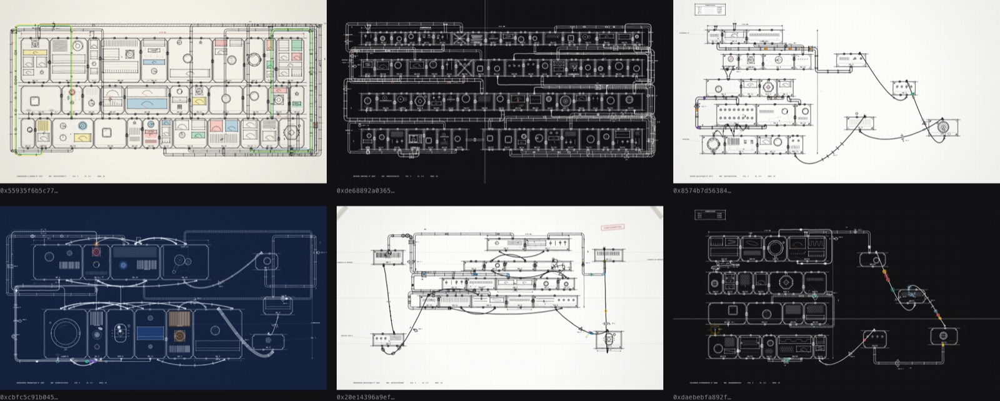

# genart — a generative art skill for Claude Code

[](CHANGELOG.md)
[](https://github.com/camilleroux/genart-skill/actions/workflows/ci.yml)
[](LICENSE)

**Create long-form generative art with AI assistance** — deterministic,
hash-seeded, ready for onchain platforms like Art Blocks, 256ART, Verse,
Highlight, Plottables and bootloader.art.

This [Claude Code](https://claude.com/claude-code) plugin teaches Claude the
working knowledge of the field: seeding a PRNG from a token hash, rendering the
same composition at any resolution, designing traits and rarity tables,
signalling preview capture, exporting for print and pen plotters, and where the
ethical lines of generative art are. It covers creative coding with Canvas 2D,
p5.js, three.js/WebGL and SVG — and ships runnable tools to verify that a sketch
really is deterministic before you mint it.

Made by a generative artist, for generative artists using AI as a studio
assistant — not as the artist.



<sub>Six seeds of *Impossible Machine* (Camille Roux) — hand-drawn technical
blueprints, one hash each. The edition-level view the scripts are there to give
you: same code, same rules, one sheet per seed.</sub>

## Install

```
/plugin marketplace add camilleroux/genart-skill
/plugin install genart@camilleroux-genart
```

Then just talk about your sketch — the skill loads on its own. Or invoke it with
`/genart`.

## What's in it

One skill, `genart`, with reference sheets loaded on demand:

- **determinism** — PRNG choice, seeding from a hash, named sub-streams, the
  things that silently break reproducibility
- **resolution** — rendering the same piece at 400px and at 4000px
- **features** — designing traits and rarity tables that survive an edition
- **ethics** — originality, attribution, licences, AI disclosure
- **tooling** — debug GUI, keyboard shortcuts, PNG and video export
- **verification** — checking a sketch before minting, and what a test can't prove
- **platforms** — Art Blocks, 256ART, Verse, Highlight, Plottables,
  bootloader.art, self-hosted

## Runnable scripts

Two scripts ship with the plugin and run in place — Claude (or you) never copies
them into a project, so updating the plugin updates them everywhere:

```
node "$CLAUDE_PLUGIN_ROOT/scripts/check.mjs"  myproject          # determinism checks
node "$CLAUDE_PLUGIN_ROOT/scripts/render.mjs" myproject --hash 0x…      # one PNG
node "$CLAUDE_PLUGIN_ROOT/scripts/render.mjs" myproject --grid 50       # contact sheet
node "$CLAUDE_PLUGIN_ROOT/scripts/render.mjs" myproject --census 5000   # rarity, measured
node "$CLAUDE_PLUGIN_ROOT/scripts/render.mjs" myproject --batch 50      # individual PNGs
```

`render.mjs --hash` is what lets Claude close the visual loop on its own: edit
the sketch, render a seed, look at the PNG, adjust. The grid and the census are
the edition-level views — what the rarity table actually produces.

What `check.mjs` prints on a sketch that holds:

```
myproject  (size 600, 3 runs)

repeatability
  ok   0xa3f1a3f1a3… → 06669011
  ok   0x77c277c277… → 7e5f6b7f

distinctness
  ok   two different hashes produce two different renders

global state (A, B, A in one page)
  ok   A=06669011 B=7e5f6b7f A'=06669011

features
  ok   stable across 3 runs: {"Palette":"Ash","Density":"Sparse"}

all checks passed
```

And on the same sketch with one `Math.random()` left in — the broken variant CI
derives from the fixture on every push, and requires to fail:

```
repeatability
 FAIL  0xa3f1a3f1a3… → e8dec1f3 / b40e8a1f / dc9b8f1f
 FAIL  0x77c277c277… → 32fa5f55 / e04d40ad / a55fea14

global state (A, B, A in one page)
 FAIL  A=e127ff40 B=55a66c50 A'=05545a48

features
 FAIL  changed between runs: {"Palette":"Ash",…} vs {"Palette":"Ember",…} vs {"Palette":"Verdant",…}

4 failure(s)
```

`distinctness` still passes there: `Math.random()` does produce two different
images. Each check covers what it covers, and no more.

They need Playwright **in your project** (`npm i -D playwright && npx playwright
install chromium` — they print this if it is missing). The plugin itself stays
dependency-free: no package.json, nothing embedded.

The contract a sketch must follow (three lines of shim for any platform) and
what the checks can and cannot prove are in `references/verification.md`.

## How the platform sheets work

They contain no version numbers, no figures and no field names — only the stable
mental model of each platform, the canonical doc URLs, and the questions to ask
those docs. Claude fetches the real documentation before writing platform code.

That is deliberate. A copied value goes stale in months and is then worse than
nothing, because you believe it. A link stays right.

## On determinism claims

Nothing here can prove cross-machine determinism, and this plugin does not claim
to. In WebGL, shader compilers, float precision, rasterisers and MSAA differ
between GPUs; in JS, transcendental functions differ between engines. What is
actually checkable is same-machine reproducibility, perceptual stability across
sizes, and feature stability. `references/verification.md` is explicit about
where the line falls.

## Maintenance

CI runs the scripts against a known-good fixture on every push (and against a
broken variant derived from it, which must fail), and checks monthly that the
URLs in the sheets still resolve — confirmed 404/DNS only, bot walls don't
count — opening an issue when one dies. The sheets contain no volatile facts,
so dead links are the only thing that rots.

## Show what you make

If you mint something with it, I would genuinely like to see it — open a
[Discussion](https://github.com/camilleroux/genart-skill/discussions) with a
render and the platform you released on, or post it and tag
[@camillerouxart](https://x.com/camillerouxart). Pieces made with the skill get
shared onward.

Reference sheets are the easiest thing to contribute: a platform that is missing,
a doc URL that moved, a mental model that is wrong. Issues and PRs welcome — the
[editorial rules](AGENTS.md) are short.

If it saved you an afternoon, a ⭐ is how the next artist finds it.

## Author

Built and maintained by **[Camille Roux](https://art.camilleroux.com)** —
generative/algorithmic artist. Maintainer of
[awesome-generative-art](https://github.com/camilleroux/awesome-generative-art),
the curated list of generative art platforms, libraries and resources.

Follow the art:
[art.camilleroux.com](https://art.camilleroux.com) ·
[X](https://x.com/camillerouxart) ·
[Instagram](https://www.instagram.com/camillerouxart/) ·
[Farcaster](https://farcaster.xyz/camilleroux) ·
[Bluesky](https://bsky.app/profile/art.camilleroux.com) ·
[Mastodon](https://genart.social/@camillerouxart) ·
[TikTok](https://www.tiktok.com/@camillerouxart)

## License

MIT.
